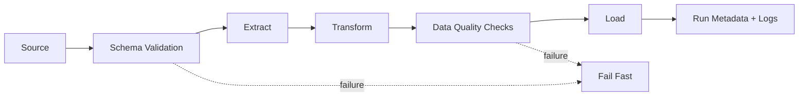

# Automated ETL Orchestration Pipeline

> A lightweight Python ETL system demonstrating ingestion, validation, transformation, scheduling, logging and run-level observability.

[](https://www.python.org/)
[](https://github.com/Kaviya-Mahendran/automated-etl-orchestration)

## Why this project matters

Manual data movement is easy to start and difficult to maintain. This project demonstrates how a small analytics workflow can become a repeatable system with explicit validation, logging and operational metadata.

## Architecture



## Pipeline responsibilities

### Extract
- Read source data
- Validate expected schema
- Fail early when required fields are missing

### Transform
- Standardise categories
- Parse dates
- Enforce numeric types
- Derive analytics-ready fields
- Remove unnecessary sensitive fields

### Load
- Write structured outputs
- Track row counts
- Control overwrite behaviour

### Observability
- Stage-level logging
- Scheduler logging
- Explicit error propagation
- Run metadata including status, row counts and duration

## Data quality controls

The pipeline is designed around explicit checks rather than assuming that source data is trustworthy.

| Control | Purpose |
|---|---|
| Schema validation | Detect unexpected/missing fields |
| Type validation | Prevent invalid analytical types |
| Null checks | Identify incomplete records |
| Duplicate checks | Prevent accidental double counting |
| Row-count tracking | Detect unexpected volume changes |
| Run metadata | Support operational debugging |

## Run locally

```bash
git clone https://github.com/Kaviya-Mahendran/automated-etl-orchestration.git
cd automated-etl-orchestration
pip install -r requirements.txt
python scripts/pipeline.py
python scheduler/schedule.py
```

## Project structure

```text
automated-etl-orchestration/
├── scripts/       # extraction, transformation and pipeline execution
├── scheduler/     # scheduling logic
├── data/          # example/local data where applicable
├── logs/          # runtime logs where applicable
├── tests/         # data and pipeline validation
└── README.md
```

## Engineering maturity roadmap

The current design provides the foundation for production-oriented ETL. Natural next steps include:

- Retries with backoff
- Incremental processing
- Idempotent loads
- Backfills
- Schema versioning
- Automated data-quality tests
- Docker packaging
- Airflow/Prefect migration
- Cloud warehouse integration
- CI checks for pipeline regressions

**Focus:** Python · ETL · data quality · orchestration · logging · analytics engineering